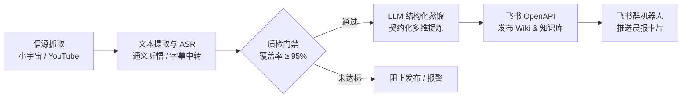

<div align="center">

# 🎧 Podcast Distill（播客蒸馏室）

**不用听完 2 小时，每天早晨 5 分钟扫读全球顶级科技、商业与创投播客的深度精华。**

[](https://github.com/SamadhiFire/podcast-distill-miaowu-external/actions/workflows/daily-digest.yml)
[](https://my.feishu.cn/wiki/space/7655607441056337129)
[](LICENSE)

---

### 📱 微信 / 飞书扫码直接阅读


**[📖 在线直达飞书知识库](https://my.feishu.cn/wiki/space/7655607441056337129?ccm_open_type=lark_wiki_spaceLink&open_tab_from=wiki_home)** &nbsp;｜&nbsp; **[🤖 飞书 AI 问答检索库](https://ask.feishu.cn/shared-space/7655607441056337129)**

*每日清晨自动发布至飞书「🎧 播客蒸馏室」，支持按日归档与全量知识库 AI 追问。无需部署，扫码即阅！*

---

</div>

## 💡 为什么需要「播客蒸馏室」？

高质量的对谈播客与深度长视频（如 Sequoia、No Priors、Dwarkesh、42章经、商业就是这样）往往长达 1～2 小时。信息密度高，但收听的时间成本极重。

市面上常见的 AI 总结往往存在两大痛点：
1. **看缩略图与简介脑补**：未真正听完整音频，总结浮于表面，丢失了嘉宾的核心论据与非显见洞察。
2. **流水账式废话**：输出一大堆未经提炼的平铺文字，无法帮助读者快速判断是否值得深入。

**Podcast Distill** 是一个全自动的长音视频深度蒸馏引擎。它像一份定制的“信息早餐”，用极严苛的数据门禁与结构化契约，把数小时的对话萃取为高浓度洞察。

---

## ✨ 核心产品价值

### 1. ⏱️ 梯度化阅读体系（尊重你的每一秒）
- **30 秒结论**：一眼看透全集终极论点，迅速决定是否需要继续阅读。
- **3 分钟速览**：早晨通勤时快速扫读今日全球各领域最关键的动态与思想共识。
- **10 分钟深读**：完整展开长文脉络、论据链条、量化事实与核心金句。

### 2. 🛡️ 100% 逐字稿严苛质检，彻底拒绝幻觉
- **无逐字稿不总结**：绝不依赖标题或简介生成。
- **双信源高质量转写**：小宇宙音频调用通义听悟 ASR 生成高精度逐字稿，YouTube 抽取官方与精准自动字幕。
- **熔断级质量门禁**：字幕覆盖率低于 95%、校验和不符或有效内容缺失时自动熔断并阻止发布，确保事实 100% 忠实于原声。

### 3. 🧠 深度结构化洞察契约
不仅是摘要，更是决策与思维工具。每期内容严格按标准契约深度提炼：
- **为什么值得看**：阐明与读者的实际关联。
- **核心要点 & 关键事实表**：提炼硬核数据、核心事件与对应上下文。
- **分歧与限制（Tensions）**：捕捉嘉宾对立观点、争议点或未解问题，拒绝盲信。
- **你可以怎么用**：提炼普通读者可直接复用的认知模型或行动启发。

### 4. 📚 飞书知识资产自动沉淀与 RAG 问答
- **优雅的月份/日期双层 Wiki 归档**：自动归入飞书知识库「🎧 播客蒸馏室」，按「年份-月份 / 日报」两级目录自动建档并永久自动保持倒序（最新在上），侧边栏清爽整洁，永不产生重复节点。
- **全量知识 RAG 检索**：所有历史播客均已接入飞书知识问答，随时向 AI 追问：“上周有哪些嘉宾讨论过具身智能的落地壁垒？”

---

## 📑 日报版式与示例

每期自动生成的日报呈现如下清晰的信息分层结构：

```text
# YYYY-MM-DD 播客与视频更新日报

# 3 分钟速览
1. 核心议题 A：30 字精粹总结...
2. 核心议题 B：30 字精粹总结...

# 全部更新

## 科技 / AI / VC
### 1. [单篇精炼标题]
原始标题 | 栏目 | 平台 | 时长 | 推荐指数 ★★★★☆

- 【30 秒结论】：全集终极见解
- 【为什么值得看】：与行业/个人的关键关联
- 【完整摘要 · 深读】：多段连贯逻辑演进与论证
- 【核心要点】：3~7 条关键逻辑主线
- 【关键事实】：结构化事实清单与量化数据
- 【分歧与限制】：未决问题、争议与现实阻碍
- 【你可以怎么用】：可落地的行动启示与思考模型
```

---

## 🌐 追踪信源版图

精选海内外顶级创投、商业与深度思想频道，持续更新：

| 领域 | 代表性信源 |
| :--- | :--- |
| **科技 / AI / VC** | 42章经、the prompt、科技早知道、Sequoia Capital、No Priors、The OpenAI Podcast、Dwarkesh Podcast、Bg2 Pod |
| **商业 / 财经 / 投资** | 商业就是这样、无人知晓、面基、高能量、先声、Bloomberg Originals、Invest Like The Best、Acquired、Odd Lots |
| **产品 / 创业 / 管理** | 张小珺商业访谈录、Lenny's Podcast、The Knowledge Project、Silicon Valley Girl |
| **全球议题 / 深度思想** | 忽左忽右、声东击西、Lex Fridman 等优质长访谈播客 |

---

## ⚙️ 系统工作流水线

全流程托管于 GitHub Actions，完全无服务器（Serverless）运行：



---

## 🚀 自托管与部署指南

如果你希望搭建属于自己的播客蒸馏室，或自定义关注的播客信源，只需简单三步：

### 1. Fork 本仓库并配置 GitHub Secrets

在 GitHub 仓库的 `Settings` -> `Secrets and variables` -> `Actions` 中配置以下环境变量：

| 类别 | Secret 名称 | 作用说明 |
| :--- | :--- | :--- |
| **听悟 ASR** | `TINGWU_APP_KEY`<br/>`ALIBABA_CLOUD_ACCESS_KEY_ID`<br/>`ALIBABA_CLOUD_ACCESS_KEY_SECRET` | 阿里云通义听悟语音转文字 API 凭证 |
| **大语言模型** | `LLM_BASE_URL`<br/>`LLM_API_KEY`<br/>`LLM_MODEL` | 兼容 OpenAI / 通义千问等 LLM 接口，负责提炼结构化日报 |
| **YouTube 字幕** | `MEDIA_API_TOKEN` | 外部 YouTube 字幕中转服务 Token（避免 GitHub Actions IP 受限） |
| **飞书知识库** | `FEISHU_APP_ID`<br/>`FEISHU_APP_SECRET`<br/>`FEISHU_WIKI_SPACE_ID`<br/>`FEISHU_NOTIFY_WEBHOOK` | 飞书开放平台自建应用凭据、知识空间 ID 与群机器人 Webhook |

> [!TIP]
> 飞书发布通过官方开放平台 OpenAPI 完成，无需浏览器 Cookie 或 Playwright 模拟登录。

### 2. 自定义订阅信源

编辑 `config/` 目录下的配置文件即可调整监听列表：
- `config/xiaoyuzhou_sources.json`：小宇宙播客列表
- `config/youtube_sources.txt`：YouTube 频道 / 播放列表链接
- `config/sources_by_category.md`：多赛道分类映射

### 3. 运行与调度

- **定时调度**：GitHub Actions 会在每天清晨自动触发更新工作流（`.github/workflows/daily-digest.yml`）。
- **手动触发**：也可在 GitHub 仓库的 Actions 页面选择工作流手动点击「Run workflow」运行。

---

## 📂 项目结构

```text
├── .github/workflows/       # GitHub Actions 自动化工作流
├── config/                  # 信源配置（小宇宙、YouTube 订阅清单）
├── docs/                    # 知识资产与进阶架构说明
│   └── assets/              # 飞书知识库二维码等静态资源
├── scripts/                 # 核心引擎脚本
│   ├── tingwu_xiaoyuzhou_daily.py   # 小宇宙抓取与听悟 ASR 转写
│   ├── validate_transcript_bundle.py# 逐字稿覆盖率质检门禁
│   ├── generate_daily_report.py     # 结构化日报生成核心引擎
│   └── publish_feishu.py            # 飞书 Wiki 幂等发布与机器人通知
├── templates/               # 日报 Prompt 契约规范
└── extract_subtitles.py     # YouTube 字幕提取服务适配器
```

---

## 🤝 体验与交流

欢迎扫码关注飞书知识库，或在 Issue / PR 中推荐你喜欢的优质播客信源！
